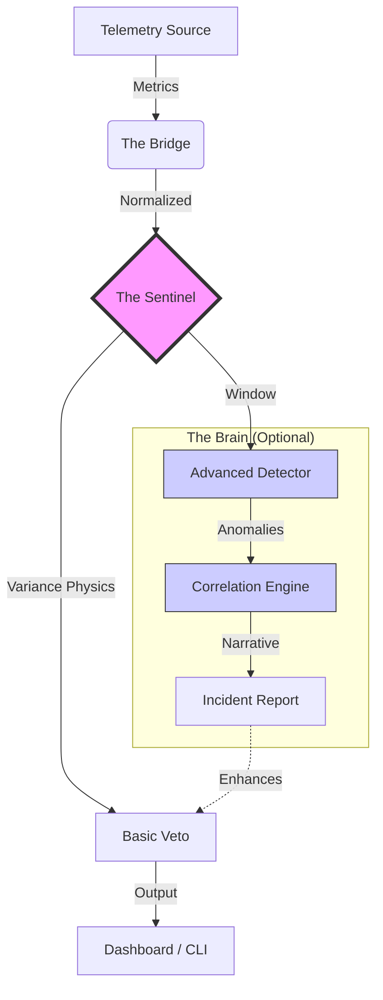

# Coherence SRE: The Variance Sentinel

[](https://github.com/ZoaGrad/coherence-sre/actions/workflows/main.yml)

[](https://opensource.org/licenses/MIT)
[](https://www.python.org/downloads/)
[]()
[]()

**Detect system instability 4 hours before the crash.**

Coherence is a deterministic SRE engine that monitors the *variance* (instability) of your infrastructure rather than just the *average* (load). It detects "Silent Failures"—retry storms, memory churn, and thread thrashing—that traditional dashboards miss.

### ⚡ The Problem: Averages Lie

Most monitoring tools alert on thresholds (e.g., `CPU > 80%`). By the time CPU hits 80%, the cascading failure has already begun.

* **Seizure (Computational Entropy):** Detects when variance explodes while averages remain normal.
* **Fever (Resource Leaks):** Tracks allocation velocity (MB/s) rather than just capacity.
* **Auto-Immune (Retry Storms):** Identifies amplification ratios in network traffic.

---

### 🛠 Architecture (Phase 3.3)

Coherence uses a **Hybrid Architecture** that degrades gracefully from Advanced Machine Learning to Basic Physics.



- **Core (Physics):** Always on. Uses mathematical variance to detect chaos.
- **Brain (Synaptic Upgrade):** Activates if `pandas` is present. Uses Z-Score and Inter-Quartile Range to construct "Narratives."
- **Interface:** CLI for Engineers, Streamlit "Glass Cockpit" for Executives.

---

### 🚀 Usage

#### 1. The Terminal (Engineer View)
Runs the lightweight TUI. Safe for production sidecars.

```bash
pip install .
python -m coherence.core.sentinel --source sim
```

#### 2. The Glass Cockpit (War Room View)
Launches the "Overwatch" dashboard. Visualizes variance in real-time.

```bash
pip install ".[dashboard]"
streamlit run src/coherence/ui/webapp.py
```
*Features: Red-Zone Seizure Overlay, Real-time Trace, Narrative Display.*

#### 3. Live Ingestion (Datadog)
Connects to real telemetry (Read-Only).

```bash
pip install ".[connectors]"
# Configure .env with DATADOG_API_KEY
python -m coherence.core.sentinel --source datadog
```

---

### 🐳 Deployment (Docker)

Coherence is designed to run as a sidecar container in Kubernetes or ECS.

```bash
# Build
docker build -t coherence-sre .

# Run (Simulation)
docker run -it --rm coherence-sre

# Run (Production / Datadog)
docker run -it --rm --env-file .env coherence-sre --source datadog
```

### 🧠 The Philosophy: System 5 Veto

Distributed systems fail because of unbounded recursion and positive feedback loops. Coherence enforces the **System 5 Veto**: It does not "fix" the bug. It recommends a Non-Algorithmic Veto (Load Shedding, Circuit Breaking) to preserve the system's core integrity.

### 🛡️ License

MIT License. Free for everyone.
