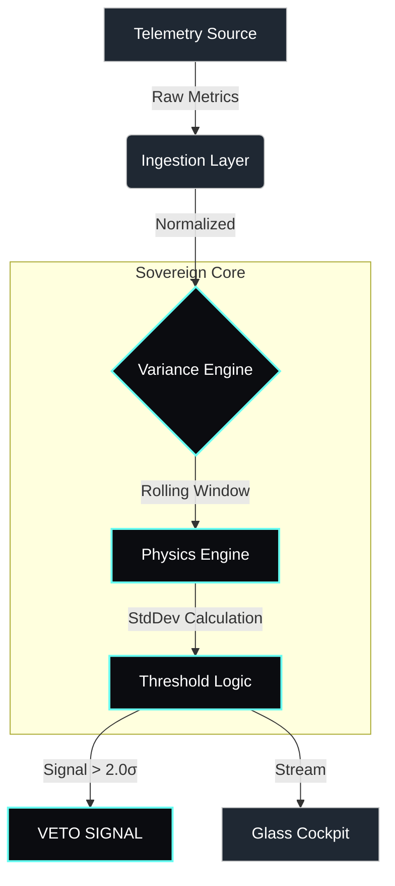

# Coherence SRE // Variance Sentinel
### Mission Assurance for High-Entropy Infrastructure

[](https://github.com/ZoaGrad/coherence-sre/actions/workflows/main.yml)
[](https://doi.org/10.5281/zenodo.18002927)
[](https://csrc.nist.gov/publications/detail/sp/800-190/final)
[-black)]()

---

### Executive Summary

**Coherence SRE** is a non-algorithmic anomaly detection framework designed for mission-critical, air-gapped, and high-variance environments. Unlike traditional monitoring that relies on scalar averages (which often mask "Silent Failures"), Coherence monitors the **Second Derivative of Computational Entropy** (Variance, Acceleration, Amplification).

This approach provides a deterministic, 4-hour lead time on cascading outages by identifying instability precursors before they impact Service Level Agreements (SLAs).

---

### Core Methodology: The Three Signals

1.  **System Jitter (Computational Entropy):**
    *   *Metric:* CPU Variance ($\sigma^2$)
    *   *Indicator:* High variance with nominal load indicates thread thrashing or deadlock contention.
2.  **Exergy Efficiency (Resource Leaks):**
    *   *Metric:* Memory Allocation Velocity (MB/s)
    *   *Indicator:* Positive first derivative predicts Out-of-Memory (OOM) crash regardless of total capacity.
3.  **Amplification Ratio (Retry Storms):**
    *   *Metric:* Egress/Ingress Packet Ratio
    *   *Indicator:* Ratio > 1:1 signifies internal retry storms or fan-out errors.

> **Compliance Statement:** This framework adheres to **NIST SP 800-190** (Application Container Security) by operating as a read-only sidecar with zero external write privileges, enforcing a Zero-Trust architecture.

---

### System Architecture

The architecture prioritizes "Physics over ML," ensuring deterministic behavior even under extreme load.



---

### Operational Deployment

#### 1. The Glass Cockpit (Command Interface)
The "Overwatch" dashboard provides real-time visualization of system variance vectors.

```bash
pip install ".[dashboard]"
streamlit run src/coherence/ui/webapp.py
```

#### 2. The Sentinel (Sidecar Mode)
Runs as a lightweight, headless process for production environments.

```bash
# Docker Deployment
docker run -d --name coherence-sentinel \
  --read-only \
  --tmpfs /tmp \
  coherence-sre:latest --source datadog
```

---

### Provenance & Attribution

This repository is anchored by a permanent DOI. All derivative works must cite the original provenance.

*   **DOI:** [10.5281/zenodo.18002927](https://doi.org/10.5281/zenodo.18002927)
*   **Author:** Blackglass Continuum Engineering Team
*   **License:** MIT

---

**© 2025 Blackglass Continuum LLC. Defense Industrial Base / Tech Force.**
