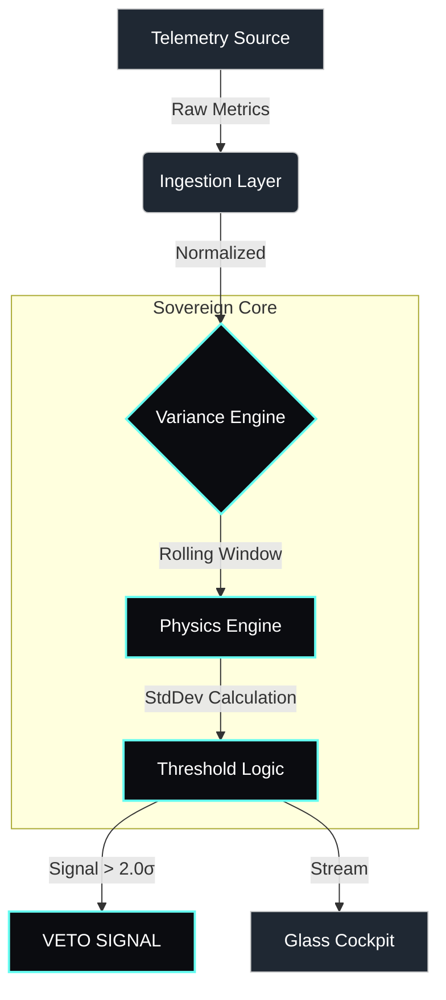

# Coherence SRE // Variance Sentinel

> **STATUS:** `ACTIVE` | **COMPLIANCE:** `ISO 9001:2015 ALIGNED` | **CAGE:** `17TJ5`
>
> *This software is architected and maintained under the Blackglass Continuum Quality Management System. See [Governance Standards](./governance/ISO_9001_ALIGNMENT.md) for compliance details.*
### Mission Assurance for High-Entropy Infrastructure

[](https://github.com/ZoaGrad/coherence-sre/actions/workflows/main.yml)
[](https://doi.org/10.5281/zenodo.18002927)
[](https://csrc.nist.gov/publications/detail/sp/800-190/final)
[-black)]()

**Operator:** Blackglass Continuum LLC  
**Federal Registration:** CAGE Code **17TJ5** · UEI **SVZVXPTM9AF4**  
**Status:** U.S. Federally Registered Entity · Government-Eligible Contractor

---

### Executive Summary

**Coherence SRE** is a read-only site reliability analysis framework for high-variance, mission-critical environments.

Rather than relying on static thresholds or trained models, Coherence evaluates second-order changes in system telemetry — variance, rate-of-change, and amplification — to identify early indicators of instability that precede service degradation.

The framework is designed for deterministic behavior, reproducible analysis, and safe deployment in air-gapped or regulated infrastructure.

---

### Core Methodology: Second-Order Stability Signals

1.  **System Jitter (CPU Variance):**
    *   **Metric:** CPU Variance ($\sigma^2$)
    *   **Interpretation:** Elevated variance under nominal load indicates execution instability such as contention or deadlock precursors.
2.  **Exergy Efficiency (Resource Leaks):**
    *   **Metric:** Memory Allocation Velocity (MB/s)
    *   **Interpretation:** Positive first derivative indicates resource saturation trends independent of total capacity.
3.  **Amplification Ratio (Retry Storms):**
    *   **Metric:** Egress/Ingress Packet Ratio
    *   **Interpretation:** Ratio > 1:1 indicates internal retry amplification or fan-out anomalies.

### Compliance & Security Posture

This framework adheres to **NIST SP 800-190 (Application Container Security)** by operating exclusively as a read-only sidecar with no control-plane access, no external write privileges, and no automated remediation capabilities.

---

### System Architecture

The architecture prioritizes "Physics over ML," ensuring deterministic behavior even under extreme load.



### Non-Goals

Coherence SRE does not:
- Perform automated remediation
- Modify production systems
- Train or adapt machine learning models
- Require privileged control-plane access

---

### Operational Deployment

#### 1. The Glass Cockpit (Command Interface)
The "Overwatch" dashboard provides real-time visualization of system variance vectors.

```bash
pip install ".[dashboard]"
streamlit run src/coherence/ui/webapp.py
```

#### 2. The Sentinel (Sidecar Mode)
Runs as a lightweight, headless process for production environments.

```bash
# Docker Deployment
docker run -d --name coherence-sentinel \
  --read-only \
  --tmpfs /tmp \
  coherence-sre:latest --source datadog
```

---

### Provenance & Attribution

This repository is anchored by a permanent DOI. All derivative works must cite the original provenance.

*   **DOI:** [10.5281/zenodo.18002927](https://doi.org/10.5281/zenodo.18002927)
*   **Author:** Blackglass Continuum Engineering Team
*   **License:** MIT

---

**© 2025 Blackglass Continuum LLC. Defense Industrial Base / Tech Force.**
